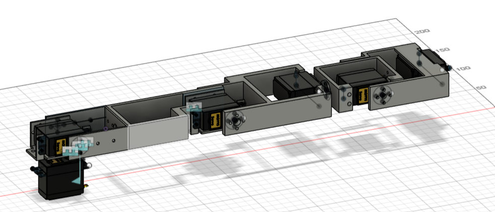
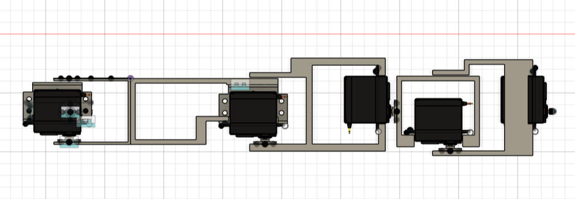
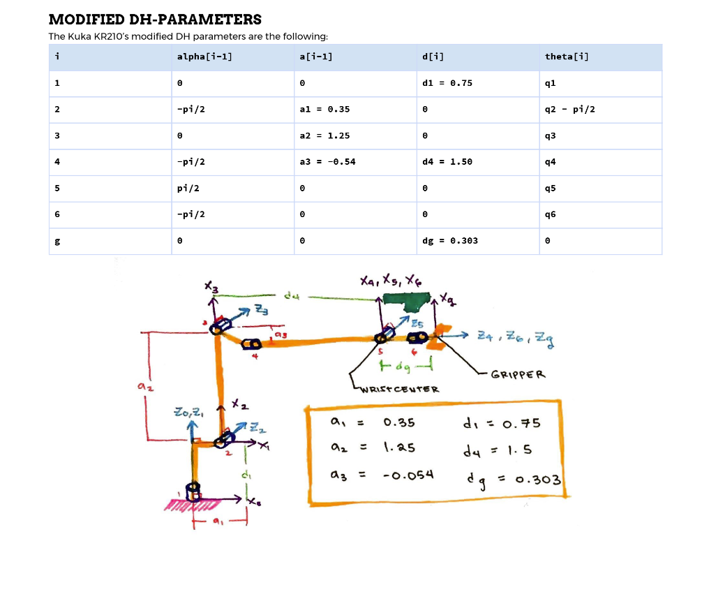

# Robotic Arm
This is a 6-degree-of-freedom robotic arm that I designed and programmed, featuring inverse kinematics for movement control. 

This is a demo where it steps affector only left/right.   

## Build Description 

CAD views of version 1. 

CAD views of version 2. This uses gearbox to drive servos at lower voltage and puts the stress a its axel instead of the servo.

Two daisy chained PCA9685s are used to drive the servos and they are powered by a 5V 20A power supply. 

## Inverse Kinematics

The key idea to calculating the inverse kinematics for this is that the wrist position is only dependent on the first three joints.
To solve for the angles : 

1) Solve for the wrist position 
2) Solve for the first three angles 
    1) The first one is trivial
    2) THe second and third become a 2d inverse kinematics problem with 2 links

3) Solve for the last three angles 
    1) By using homogenous transformation matricies, calculate numerically the transformation from wrist to the end affector
    2) Equate to the algebraic tranformation and solve the system of equations for the angles
 
I used modified DH parameters to describe the joint relationships. This diagram shows a simmilar arm and its DH parameters. 

The diagram above was taken from [this document by Mithi Sevilla.](https://github.com/mithi/arm-ik/blob/master/WRITEUP.pdf) 
